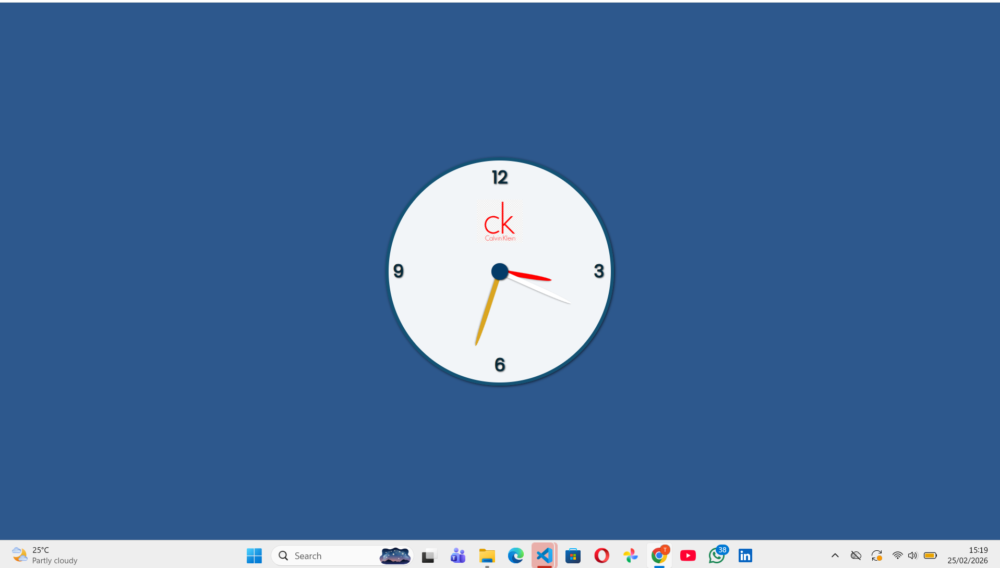

# 🕒 Analog Clock Web App

A simple and responsive **Analog Clock** built using **HTML, CSS, and JavaScript**.
This project displays the current system time using rotating clock hands (hour, minute, and second) and updates automatically every second.

---
## 🚀 Features
* 🕒 Real-time analog clock
* ⚡ Updates every second automatically
* 🎨 Clean and modern clock design
* 💻 Responsive centered layout
* 🔄 Smooth rotation of clock hands
* 🧠 Built with pure JavaScript (No frameworks)
* 🧩 Simple and beginner-friendly project

---
## 🛠️ Technologies Used
* HTML5
* CSS3 (Flexbox & Positioning)
* JavaScript (Vanilla JS)

---
## 📂 Project Structure
```
Analog-Clock/
│
├── index.html
├── style.css
├── script.js
├── clock-image.png
└── README.md
```
---

## ⚙️ How It Works
### 1️⃣ Clock Layout
HTML creates:
* Clock container
* Clock numbers (12, 3, 6, 9)
* Hour hand
* Minute hand
* Second hand
---
### 2️⃣ Clock Styling
CSS is used to design:
* Circular clock shape
* Clock colors
* Numbers positions
* Clock hands
* Center circle
* 
Important property used:

```
transform-origin: bottom center;
```
This allows the clock hands to rotate from the center.
---

### 3️⃣ Clock Logic
JavaScript gets the current time from the system.
```
const currentDate = new Date();
```
The program reads:
* Hours
* Minutes
* Seconds

Then converts them into rotation angles.
Example:
```
const hourDeg = (hour % 12) / 12 * 360 + (minutes / 60) * 30;
```
The clock updates every second.
```
setInterval(updateClock, 1000);
```

---

## 🕒 Clock Rotation Formula
### Hour Hand
```
(hour % 12) / 12 × 360 + (minutes / 60 × 30)
```

### Minute Hand
```
(minutes / 60) × 360
```

### Second Hand
```
(seconds / 60) × 360
```

---

## ▶️ How to Run the Project
1. Download or clone the repository:
```
git clone https://github.com/takundagorogodo/analog-clock.git
```
2. Open the project folder.
3. Open `index.html` in your browser.
No installations required.

---

## 🖼️ Screenshot

---

## 🎯 What I Learned

* DOM Manipulation
* Working with Date object in JavaScript
* CSS positioning
* Transform and rotation
* Real-time updates
* setInterval function
* Styling UI components
---

## 📌 Future Improvements

* Add digital clock display
* Add dark mode
* Add themes
* Add date display
* Smooth second hand animation
* Add time zone selection
* Mobile optimization
* Deploy on GitHub Pages
---

## 👨‍💻 Author

Takundah Gorogodo

CSE Student | Machine Learning Enthusiast

---
## 📄 License

This project is open-source and available for learning and educational purposes.
